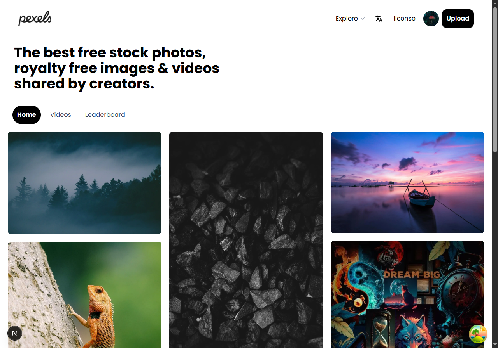
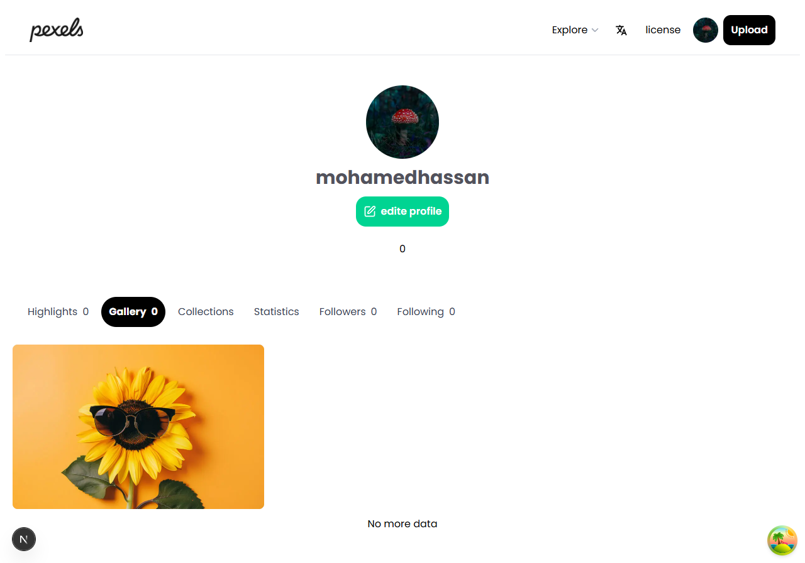

# pexel clone
#### A full-stack platform inspired by Pexels that allows users to upload, explore, and interact with high-quality media content, with advanced features like image processing and analytics.

##  Preview
### Home 

### Profile 

# features
- Auth 
- Post photos and videos
- interactions on Posts
- Profile Statistics
- download content
- Extract image colors
- Internationalization
## 🖥 client
- nextjs
- react-form-hooks and ZOD for form validation
- react-query
- rechart for charts
- redux/toolkit
## ⚒ server 
- nestjs
- mongoose
- jwt
- sharp
## 🔰 security
- rate limiting
- json web token

